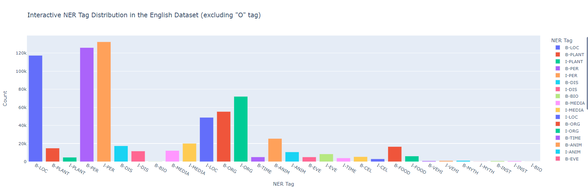

## MultiNERD Named Entity Recognition (NER) Project Overview

This project focuses on training and evaluating a Named Entity Recognition (NER) model for English using the MultiNERD dataset. The goal is to develop two systems (System A and System B) by fine-tuning a pre-trained language model on the English subset of the dataset, filtering out non-English examples, and predicting five entity types (PERSON, ORGANIZATION, LOCATION, DISEASES, ANIMAL) along with the 'O' tag.

## Notebooks Explanation

### 1. Dataset_Exploration_(EDA).ipynb

- **Objective:**
  - Explore the MultiNERD dataset and gain insights into its structure and characteristics.
  - Understand the distribution of entity types and relevant patterns.
  - For example, Please find below the Interactive NER Distribution.

### 2. SystemA_RISE.ipynb

- **Objective:**
  - Fine-tune a pre-trained language model(distilbert-base-uncased) on the English subset of the training set (System A).
  - Evaluate the model's performance on relevant metrics.

### 3. SystemB_RISE.ipynb

- **Objective:**
  - Modify the dataset to predict five entity types (PERSON, ORGANIZATION, LOCATION, DISEASES, ANIMAL) and the 'O' tag.
  - Fine-tune the model(distilbert-base-uncased) on the filtered dataset (System B).
  - Evaluate the performance of System B.


## Instructions to Run the Notebooks

To replicate the experiments and results from this project, follow the steps below. Ensure that you have Python and Jupyter Notebook installed on your machine.

## Step 1: Clone the Repository

```bash
git clone <repository_url>
cd <repository_directory>
```

## Step 2: Install Dependencies

```bash
pip install -r requirements.txt
```

This command will install all the required Python packages specified in the `requirements.txt` file.

## Step 3: Run the Notebooks

```bash
jupyter notebook Filename
```


## Evaluation Metrics

### System A

#### Training Metrics

| Epoch | Training Loss | Validation Loss | Precision | Recall | F1 | Accuracy |
|-------|----------------|------------------|-----------|--------|----|----------|
| 1     |0.032200	|0.048987	|0.888514	|0.890288	|0.889400	|0.982626|
| 2     |0.018300|	0.055056|	0.898208|	0.895242|	0.896723|	0.983373      |
| 3     | 	0.012000	|0.060297	|0.891088|	0.902346|	0.896682|	0.983301    |


#### Test Set Metrics

| Metric   | Value      |
|----------|------------|
| Accuracy | 0.9874216555003242         |
| Precision|  0.9161662817551963          |
| Recall   | 0.9281341392084227        |
| F1       | 0.9221113801452784          |

### System B

#### Training Metrics

| Epoch | Training Loss | Validation Loss | Precision | Recall | F1 | Accuracy |
|-------|----------------|------------------|-----------|--------|----|----------|
| 1     | 0.016100              | 0.025468                | 0.928652         | 0.943077      | 0.935809  | 0.991401        |
| 2     | 0.007900              | 0.029986                | 0.935057         | 0.945515      | 0.940257  | 0.991794        |
| 3     | 0.004300              | 0.034900                | 0.936945         | 0.943842      | 0.940381  | 0.991845        |


#### Test Set Metrics

| Metric   | Value      |
|----------|------------|
| Accuracy | 0.9916259635472948          |
| Precision| 0.9374331321949758          |
| Recall   | 0.9540089717346806          |
| F1       | 0.94564841996201          |

 
---

This template provides a structure for presenting the training and test set metrics for both System A and System B. Replace the placeholders with the actual values when you have the results.
## Result discussions (Max 200 words)

The choice of the model architecture, specifically 'distilbert-base-uncased,' significantly influenced the performance of both Systems. 

The superior performance of System B can be attributed to its focused approach, which means that the model is trained to predict only five specific entity types, namely PERSON, ORGANIZATION, LOCATION, DISEASES, and ANIMAL, along with the 'O' tag. By narrowing the prediction scope, the model gains a more specialized understanding of these entity categories. This allows it to allocate more attention and resources to capturing the intricacies and nuances associated with these specific types. This focused training not only streamlines the learning process but also reduces the potential confusion that may arise from a broader set of entity types. System B, having a clearer objective, excels in recognizing and distinguishing between the designated entities, leading to heightened precision, recall, and overall model performance. Additionally, the reduced label space minimizes the likelihood of misclassifications, contributing to the model's enhanced accuracy on the test set.

While these models achieve impressive results, it's important to recognize their potential limitations such as data biases and limited scope for generalization. A more comprehensive exploration of the model, including hyperparameter tuning and diverse dataset augmentation, can improve the model's robustness.
